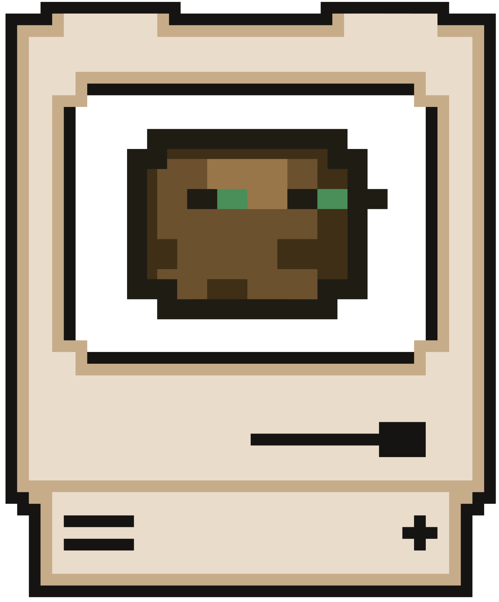

<h1 align="center">
   
  Substrate
</h1>

<h4 align="center">The AI-native IDE for robotics and physical computing</h4>

  <a href="https://bedrockdynamics.studio/download">Download</a> &bull;
  <a href="https://bedrockdynamics.studio/changelog">Changelog</a> &bull;
  <a href="https://docs.bedrockdynamics.studio">Documentation</a> &bull;
  <a href="https://github.com/Bedrock-Dynamics/substrate/projects">Roadmap</a>

---

## What is this repo?

This is the **community hub** for [Substrate](https://bedrockdynamics.studio), an IDE for robotics and embedded systems by Bedrock Dynamics.

Substrate is not open-source. This repo exists for:

- **Changelogs** — LLM-digested release notes in [`changelogs/`](changelogs/)
- **Bug reports** — [Report a bug](https://github.com/Bedrock-Dynamics/substrate/issues/new?template=bug_report.yml)
- **Feature requests** — [Request a feature](https://github.com/Bedrock-Dynamics/substrate/issues/new?template=feature_request.yml)
- **Roadmap** — [View what's planned](https://github.com/Bedrock-Dynamics/substrate/projects)

## Download

Substrate is available for macOS, Windows, and Linux.

**[Download the latest version](https://bedrockdynamics.studio/download)**

## Security

Found a vulnerability? Please see our [Security Policy](SECURITY.md).
